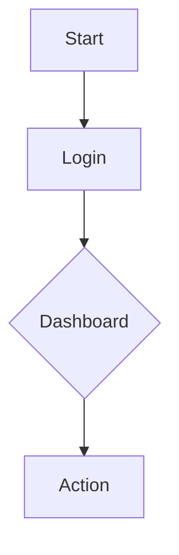

# TEST PLAN: [Project Name]

---
**Project Details**
- **Project Name:** [Insert Project Name]
- **Version:** [Insert Version, e.g., 1.0.0]
- **Date:** [Insert Date]
- **Department:** [Insert Department]
- **Organization:** [Insert Organization Name]

---
<!-- Page Break -->

## Table of Contents
1. [Version History](#version-history)
2. [Review & Approval History](#review--approval-history)
3. [Introduction](#introduction)
4. [Scope](#scope)
5. [Objectives](#objectives)
6. [Assumptions & Risks](#assumptions--risks)
7. [Functional & Requirement Specifications](#functional--requirement-specifications)
8. [Planning & Flow](#planning--flow)
9. [Test Approach & Stages](#test-approach--stages)
10. [Test Types & Completion Criteria](#test-types--completion-criteria)
11. [Test Deliverables](#test-deliverables)
12. [Environmental Needs](#environmental-needs)
13. [Roles & Responsibilities](#roles--responsibilities)

---
<!-- Page Break -->

## Version History
| Version | Date | Description | Author |
| :--- | :--- | :--- | :--- |
| 0.1 | [Date] | Initial Draft | [Name] |

## Review & Approval History
| Name | Role | Date | Signature/Status |
| :--- | :--- | :--- | :--- |
| [Name] | QA Manager | | Pending |
| [Name] | Project Manager | | Pending |

---
<!-- Page Break -->

## Introduction
[Provide a brief overview of the project and why this test plan is being created.]

## Scope
- **In-Scope:**
  - [Point 1]
  - [Point 2]
- **Out-of-Scope:**
  - [Point 1]

## Objectives
- [Objective 1: Ensure stability of the core login module.]
- [Objective 2: Validate 100% of functional requirements.]

## Assumptions & Risks
- **Assumptions:**
  - [Assumption 1: Test environment will be available 24/7.]
- **Risks:**
  - [Risk 1: Potential delay in API development.]
  - **Mitigation:** [Early mock implementation.]

---
<!-- Page Break -->

## Functional Specifications
[Map high-level functions to be tested.]

## Requirement Specifications
| REQ-ID | Description | Priority |
| :--- | :--- | :--- |
| FR-01 | [Functional Req Description] | High |

## Planning & Flow

---
<!-- Page Break -->

## Test Approach
[Describe the overall strategy: Manual vs Automated, Black box vs White box.]

## Test Stages
1. **Unit Testing**
2. **Integration Testing**
3. **System Testing**
4. **User Acceptance Testing (UAT)**

## Test Types & Criteria
| Test Type | Objective | Technique | Completion Criteria | Special Considerations |
| :--- | :--- | :--- | :--- | :--- |
| **Functional** | Validate features | Black Box | 100% Passed | None |
| **Regression** | Ensure no breakages | Automated | 0 New Issues | Run on every build |
| **Security** | Find vulnerabilities | Penetration | No Criticals | Use OWASP Top 10 |

---
<!-- Page Break -->

## Test Deliverables
- [Initial Test Plan]
- [Test Case Documents]
- [Defect Reports]
- [Test Summary Report (TSR)]

## Environmental Needs
### Hardware
- [Generic: Servers, Laptops, Mobile Devices]
### Software
- [OS, Browsers, DBs, Automation Tools]
### Other
- [VPN Access, Test Data]

## Roles & Responsibilities
| Role | Responsibility |
| :--- | :--- |
| Test Lead | Planning and Coordination |
| QA Engineer | Test Case Authoring & Execution |
| Developer | Bug Fixing |

---
